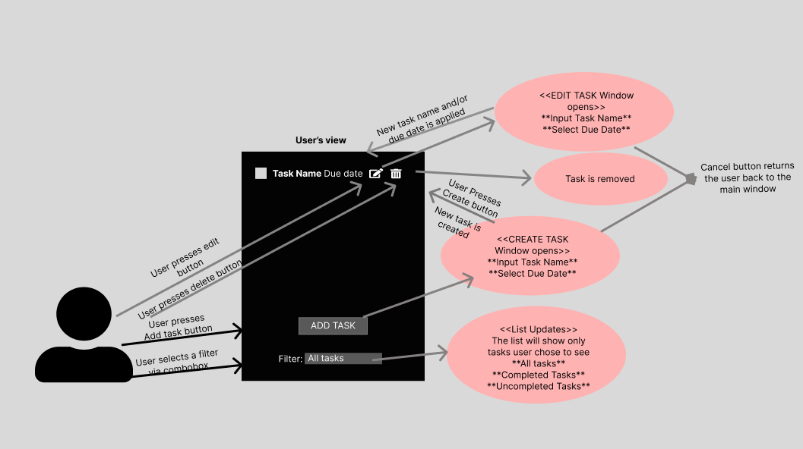
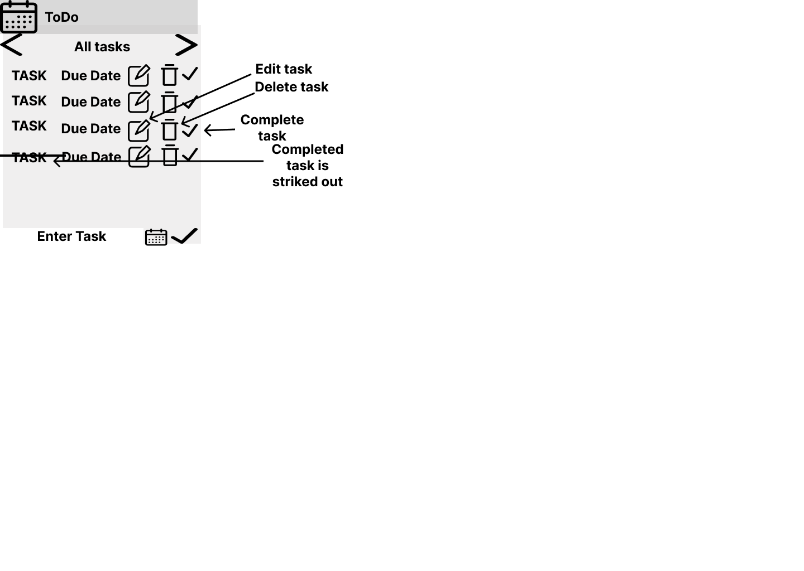
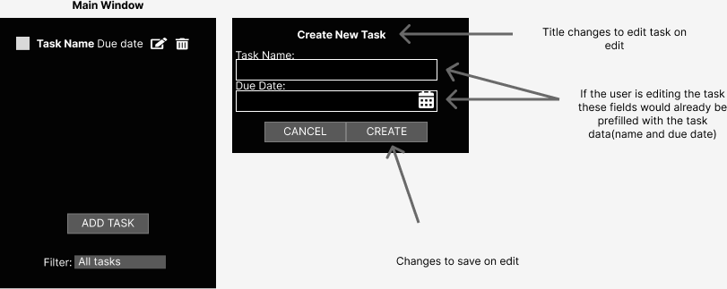

# Unit 16 - A2 Object-Oriented Programming

- [Unit 16 - A2 Object-Oriented Programming](#unit-16---a2-object-oriented-programming)
  - [I. Design](#i-design)
    - [A. Requirements](#a-requirements)
      - [1. Todo List](#1-todo-list)
      - [2. Index System](#2-index-system)
    - [B. Design](#b-design)
      - [**1. Todo List**](#1-todo-list-1)
      - [**Data Dictionary - Todo List:**](#data-dictionary---todo-list)
      - [**2. Index System:**](#2-index-system-1)
      - [**Data Dictionary - Index System:**](#data-dictionary---index-system)
    - [**Algorithm design - Todo List:**](#algorithm-design---todo-list)
    - [**Algorithm design - Index System:**](#algorithm-design---index-system)
  - [GUI Design](#gui-design)
    - [**GUI design - Todo List:**](#gui-design---todo-list)
  - [Test Plan](#test-plan)
    - [**Test Plan - Todo List:**](#test-plan---todo-list)
  - [Review of the Implementation](#review-of-the-implementation)
    - [**Review of the Implementation - ToDo List:**](#review-of-the-implementation---todo-list)


## I. Design

Producing designs according to the client requirements.

### A. Requirements

#### 1. Todo List

This application is meant to demonstrate GUI(Graphical User Interface).
Requirements:

- [ ] Creating, Deleting tasks
- [ ] Tracking state, and allowing user to change state(Complete, Incomplete)
- [ ] Support for titles, descriptions, due dates(mutable), completion comments
- [ ] Displaying tasks in a list
- [ ] Filtering tasks by state

#### 2. Index System

This application is meant to demonstrate the use of a database.

Requirements:

- [ ] The program should be able to read a CSV file
- [ ] Generate unique index reference for each item
- [ ] Write the entry to a new CSV file
- [ ] A separate class responsible for allocation of serial numbers as an interface to allow alternative future implementations

### B. Design

#### **1. Todo List**

**a. Problem summary:**

The problem is to develop a Todo List application that allows users to create, delete, and manage tasks. The application should support features like tracking the completion status of tasks, setting due dates, and displaying a list of tasks. Users should be able to toggle between displaying all tasks or only incomplete tasks.

**b. Complexity:**

The complexity of the problem is moderate. It involves managing task data, implementing CRUD (Create, Read, Update, Delete) operations, and providing user-friendly interactions.

**c. Constraints:**

- Task should have properties like title, description, due date, completion status, and completion comments
- Users should be able to modify task details like: title, description, due date, completion status, and completion comments

**d. Intended users:**

The intended users are people who want to manage their tasks. The application should be easy to use and provide a good user experience.

**e. Required Interactivity:**

The Todo List application should provide the following interactivity:

- Creating new tasks by entering task details.
  
- Deleting tasks from the list.
  
- Tracking the completion status of tasks.
  
- Modifying task properties such as title, description, due date, and completion status.
  
- Displaying a list of tasks with filtering options to toggle between all tasks and incomplete tasks.

**f. Use case diagram:**



#### **Data Dictionary - Todo List:**

1. Data structures:

- Task:
  
  - title: string
  
  - description: string

  - due_date: date
  
  - completion_status: boolean
  
  - completion_comments: string

- TaskList: A collection (List) of Task objects

2. UI:

- CreateTask: A button which creates an empty task and adds it to the TaskList

- InputTaskDetails: A form which allows users to enter task details(title, description, due date, completion status, and completion comments)

- DeleteTask: A button which deletes the selected task from the TaskList

- ModifyTask: A button which allows users to modify the selected task

- FilterTasks: A button which allows users to toggle between displaying all tasks and displaying only incomplete tasks

3. Data Storage:

- TaskList: A collection (List) of Task objects stored in memory during runtime

- Implementation of persistance storage is out of scope for this project

#### **2. Index System:**

**a. Problem summary:**

The problem is to develop an Index System application that allows users to generate unique index references for items. The application should support features like reading a CSV file, generating unique index references, and writing the entries to a new CSV file.

**b. Complexity:**

The complexity of the problem is moderate. It involves reading data from a CSV file, generating unique index references, and writing the indexed data to a new CSV file.

**c. Constraints:**

- The book details are stored in a CSV file without headings.
  
- The index references should be unique for each book.

**d. Intended users:**

The intended users are the staff or administrators of the college library responsible for managing book indexing.

**e. Required Interactivity:**

The Index System application should provide the following interactivity:

- Reading book details from a CSV file.

- Generating unique index references for each book.

- Writing the indexed data to a new CSV file.

**f. Use case diagram:**

I don't believe that a use case diagram would be necessary for this application. Since the application is only meant to be opened and run once, there is no need to model the interactions between the user and the application.


#### **Data Dictionary - Index System:**

1. Data structures:

- Book:
  - Properties:
    - Name: string
    - Title: string
    - Place published: string
    - Publisher: string
    - Date of publication: date
    - Index reference: string

2. Control structures:

- CSVReader: A class which reads data from a CSV file and returns a list of Book objects
  
- SerialNumberAllocator: A class which implements an interface to allocate serial numbers
  
- CSVWriter: A class which writes data to a CSV file

3. Data Storage:

- Input CSV file: A CSV file containing book details(name, title, place published, publisher, date of publication)
- Output CSV file: A CSV file containing book details(name, title, place published, publisher, date of publication, index reference)

4. Pre-defined Code:

- CSV Parsing Library: Utilize a library or built-in functionality for parsing CSV files and extracting book details from the input file and writing book details to the output file.

### **Algorithm design - Todo List:**

**Pseudocode:**

```pseudo
START

// Initialize an empty task list
todoList = []

// Display the todo list
DISPLAY_TODO_LIST(todoList)

// User interaction loop

WHILE true
    action = PROMPT_USER_FOR_ACTION()
    
    IF action is "Add Task"
        taskDetails = PROMPT_USER_FOR_TASK_DETAILS()
        
        IF VALID_TASK_DETAILS(taskDetails)
            task = CREATE_TASK(taskDetails)
            todoList.ADD(task)
        ELSE
            DISPLAY_INVALID_INPUT_MESSAGE()
        
    ELSE IF action is "Modify Task"
        taskIndex = PROMPT_USER_FOR_TASK_INDEX(todoList)
        
        IF VALID_TASK_INDEX(taskIndex, todoList)
            modifiedTaskDetails = PROMPT_USER_FOR_MODIFIED_TASK_DETAILS(todoList[taskIndex])
            
            IF VALID_MODIFIED_TASK_DETAILS(modifiedTaskDetails)
                UPDATE_TASK(todoList[taskIndex], modifiedTaskDetails)
            ELSE
                DISPLAY_INVALID_INPUT_MESSAGE()
        ELSE
            DISPLAY_INVALID_INPUT_MESSAGE()
        
    ELSE IF action is "Delete Task"
        taskIndex = PROMPT_USER_FOR_TASK_INDEX(todoList)
        
        IF VALID_TASK_INDEX(taskIndex, todoList)
            todoList.REMOVE(taskIndex)
        ELSE
            DISPLAY_INVALID_INPUT_MESSAGE()
        
    ELSE IF action is "Mark Task as Complete"
        taskIndex = PROMPT_USER_FOR_TASK_INDEX(todoList)
        
        IF VALID_TASK_INDEX(taskIndex, todoList)
            todoList[taskIndex].SET_COMPLETED(true)
        ELSE
            DISPLAY_INVALID_INPUT_MESSAGE()
        
    ELSE IF action is "Toggle Display Mode"
        displayMode = PROMPT_USER_FOR_DISPLAY_MODE()
        
        IF VALID_DISPLAY_MODE(displayMode)
            todoList.SET_DISPLAY_MODE(displayMode)
        ELSE
            DISPLAY_INVALID_INPUT_MESSAGE()
        
    ELSE IF action is "Exit"
        BREAK
    
    DISPLAY_TODO_LIST(todoList)
END
```

**Flowchart:**



### **Algorithm design - Index System:**

**Pseudocode:**

For the main program:

```pseudo
START
Read data from input CSV file
Initialize an empty book list

FOR EACH record in the input CSV file
    bookDetails = PARSE_RECORD(record)
    
    IF VALID_BOOK_DETAILS(bookDetails)
        indexReference = GENERATE_UNIQUE_INDEX_REFERENCE()
        combinedDetails = COMBINE_INDEX_REFERENCE_WITH_BOOK_DETAILS(indexReference, bookDetails)
        book = CREATE_BOOK(combinedDetails)
        bookList.ADD(book)
    ELSE
        DISPLAY_INVALID_RECORD_MESSAGE()
    
Add index number to each book in the book list

Write book list to output CSV file
Display success message
END


```

For the index reference generator:

```pseudo

FUNCTION GENERATE_UNIQUE_INDEX_REFERENCE():
    // Generate a unique index reference using a hashing algorithm
    timestamp = GET_CURRENT_TIMESTAMP()
    randomString = GENERATE_RANDOM_STRING(10) // Generate a random string
    
    // Combine the timestamp and random string
    dataToHash = CONCATENATE(timestamp, randomString)
    
    // Apply the hashing algorithm (e.g., SHA-256)
    hashedData = APPLY_HASH_ALGORITHM(dataToHash, "SHA-256")
    
    // Extract a portion of the hashed data as the index reference
    indexReference = GET_SUBSTRING(hashedData, 0, 8) // Extract the first 8 characters
    
    RETURN indexReference


```

**Flowchart:**



## GUI Design

I need to design a GUI for the Todo List application. The GUI should allow users to perform the actions described in the use case diagram. The GUI should also display the current state of the task list.

### **GUI design - Todo List:**

**GUI Mockup:**



**GUI Description:**

The GUI consists of the following components:

- A slide filter to filter tasks by their status (All, Active, Completed)

- A list of task with the following columns:
  - Task
  - Due Date
  - Edit
  - Delete
  - Mark as Complete
Each task will get strike-through text if it is completed.

- A field to enter a new task with buttons to set its due date, and add it to the task list

**Redesign:**



After careful consideration, I decided to give the GUI a redesign. The redesign is based on the following considerations:

- I have lacked the skill to implement specific features in the GUI. For example, I have not been able to implement the slider filter, and the strike through text for completed tasks.

- The GUI was too cluttered, the field for entering a task was too small, and the buttons like data picker and adding the task were too squished together.

The redesign fixes some of these issues with the following solutions:

- Slider filter was replaced with a drop-down menu in the bottom. I believe that this solution still offers the same functionality as the slider filter, but it is easier to implement.

- Adding a task has become an independent window. This solution allows me to make the field bigger, and possibly add more features to the window in the future.

- Completion of the tasks is now done by clicking on the checkbox next to the task. Although this solution is less superior to the strike-through text, I found it easier to implement. Strike-through text is still a feature I would like to implement in the future.

- As a design flaw I didn't think about the editing tasks feature. Which I implemented in the redesign.

- I have also added designs of add and edit task windows which are almost indentical. This is to make development easier and keep the design consistent across the application.

## Test Plan

### **Test Plan - Todo List:**

**Test Data:**

- Creating a task with various characteristics
  
  - Task Name: Valid task names(“Task 1”, “Task 2”, “Task 3”, “Task 4”, “Task 5”), Empty task name, special characters in task name, task name with length greater than 50 characters.
  - Due Date: Past date, current date, future date, empty date.

- Upon creating a task, and verify that the task is added to the list in a correct way.

- Upon creating a task with invalid characteristics, verify that the user is notified of the error and the task is not created.

- Editing a task

  - Correct task is selected for editing
  - The edited task still has the same input constraints as creating a task

- Deleting a task

  - Correct task is deleted

- Filtering tasks

  - All tasks are displayed
  - Only active tasks are displayed
  - Only completed tasks are displayed

- Marking a task as complete

  - Correct task is marked as complete
  - Filtered tasks are updated accordingly

**Test Results:**

Note: The tests were performed manually, on a Windows 10 machine, using the latest **published** version of the application. This version of the application does not provide any input validation, so only one test case was done just to check that there are no anomalies.

V1.0.1:

| Test Case | Test Data | Expected Result | Actual Result | Pass/Fail |
| --------- | --------- | --------------- | ------------- | --------- |
| Creating a valid task | Task Name: “Task 1”, Due Date: 2023-06-04 | Task is added to the list | Task is added to the list | Pass |
| Creating a task with no name | Task Name: "", Due Date: 2023-06-04 | Task is not added to the list, error message is displayed | The task is added to the list as this version currently has no input validation | Fail |

V1.0.2:

Note: The tests were performed manually, on a Windows 10 machine, using the latest **published** version of the application. This version of the application does provide input validation, so all test cases were done.

| Test Case | Test Data | Expected Result | Actual Result | Pass/Fail |
| --------- | --------- | --------------- | ------------- | --------- |
| Creating a valid| Name: “Task 1”, Due Date: 2023-06-04 | Task is added to the list | Task is added to the list | Pass |
| Creating a task with no name | Task Name: "", Due Date: 2023-06-04 | Task is not added to the list, error message is displayed | Task is not added to the list, error message is displayed | Pass |
| Creating a task with a name longer than 50 characters | Task Name: "This is a task with a name longer than 50 characters", Due Date: 2023-06-04 | Task is not added to the list, error message is displayed | Task is not added to the list, error message is displayed | Pass |
| Creating a task with a past due date | Task Name: "Task 1", Due Date: 2020-06-04 | Task is not added to the list, error message is displayed | Task is not added to the list, error message is displayed | Pass |
| Creating a task with a current due date | Task Name: "Task 1", Due Date: 2021-06-04 | Task is added to the list | Task is added to the list | Pass |
| Creating a task with a future due date | Task Name: "Task 1", Due Date: 2023-06-04 | Task is added to the list | Task is added to the list | Pass |

Note: Editing the task follows the same input validation as creating a task, so only one test case was done.

| Filtering tasks | Filter some preset tasks by their status(All, Uncompleted, Completed) | Tasks are filtered accordingly | Tasks are filtered accordingly | Pass |

## Review of the Implementation

### **Review of the Implementation - ToDo List:**

The solution was implemented using WPF( Windows Presentation Foundation) and C# and the use of Metro UI theme package. It meets most of the requirements in the specification:

- The application allows users to create, edit, delete, and filter tasks.
  - [x] The application allows users to create and delete tasks.
  - [x] It tracks the completion of the tasks and allows users to mark tasks as complete.
  - [x] The application supports titles(mutable) and due dates(mutable) for tasks.
  - [x] The application allows users to filter tasks by their status(All, Uncompleted, Completed).
  - [x] The application displays the tasks in a list.
  
- The application has not met the following requirements:
  - [ ] The application supports descriptions for tasks.
  - [ ] The application supports completed date or completed description for tasks.

**Reasons for not meeting the requirements:**

Due to the time constraints, I was not able to implement all the features I needed to. Because of the time it took to learn WPF, I have put all the attention on optimizing the application and adding features that are essential for the application like: input validation, filtering, and editing tasks. With more time, I would have been able to implement the rest of the features required.

**Displaying various Object-Oriented Programming principles:**

The application displays the following OOP principles:

- **Encapsulation**: The application uses encapsulation to hide implementation details, for example:
  
  - The TaskModel.cs class data such as task names and due dates in your TaskModel class are encapsulated within private fields (taskName and dueDate) and accessed through public properties (TaskName and DueDate). This encapsulation provides control over how the data can be accessed and modified.

    ```c#
            public class TaskModel : ObservableObject
            {
            private string taskName; // Private field for task name
            private DateTime dueDate; // Private field for due date

            public string TaskName
            {
                get { return taskName; }
                set { SetProperty(ref taskName, value); }
            }

            public DateTime DueDate
            {
                get { return dueDate; }
                set { SetProperty(ref dueDate, value); }
            }

            // Other members of the TaskModel class...

            private void EditTask()
            {
                // Code for editing a task...
            }

            private void DeleteTask()
            {
                // Code for deleting a task...
            }
        }
    ```

  - Hiding the DeleteTask and EditTask methods in the TaskModel class helps encapsulate the behavior and provides control over how tasks can be modified. By making these methods private and only accessible within the TaskModel class, you limit their visibility and prevent external entities from directly modifying tasks in an undesirable way.
  This encapsulation serves as a form of access control and ensures that modifications to tasks can only be performed through the designated public methods and properties provided by the TaskModel class.

    ```c#
            public class TaskModel : ObservableObject
        {
            // Other properties and fields...

            private void EditTask()
            {
                EditTaskWindow editTaskWindow = new EditTaskWindow((MainWindow)App.Current.MainWindow, this);
                editTaskWindow.ShowDialog();
            }

            private void DeleteTask()
            {
                if (Application.Current.MainWindow is MainWindow mainWindow)
                {
                    mainWindow.ListBoxTasks.Remove(this);
                }
            }
        }
    ```

- **Inheritance**: The application uses inheritance to extend the functionality of the MainWindow, CreateTaskWindow and EditTaskWindow classes. 

    ``` c#

    #region MainWindow

    public partial class MainWindow : MetroWindow
    {
        
    }

    #endregion

    #region CreateTaskWindow

    public partial class CreateTaskWindow : MetroWindow
    {
        
    }

    #endregion

    #region EditTaskWindow

    public partial class EditTaskWindow : MetroWindow
    {
        
    }

    #endregion
    ```
